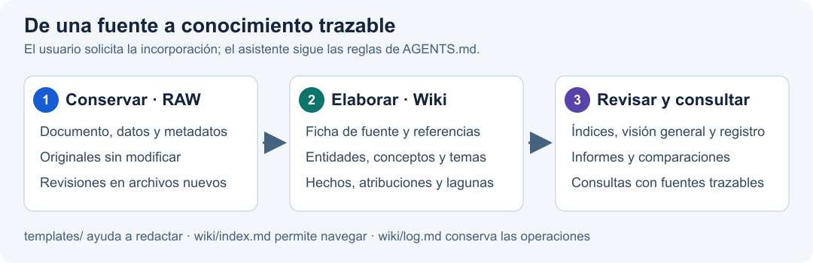

# 🧠 Second Brain ADA NIGHT

 

Base de conocimiento personal en español para investigar **Cardano (ADA)** y **Midnight (NIGHT)**. Reúne documentos, datos e informes con su procedencia, y los convierte en páginas relacionadas que pueden consultarse y actualizarse con ayuda de un asistente.

Sigue la propuesta **LLM Wiki de Andrej Karpathy**: conservar las fuentes, elaborar conocimiento a partir de ellas y mantener sus referencias e historial. La [guía original](llm-wiki.md), su [traducción al español](llm-wiki-es.md) y las [instrucciones del proyecto](AGENTS.md) explican el enfoque.

El repositorio principal es [SecondBrain-ADA-NIGHT en GitHub](https://github.com/Ju4nC4r/SecondBrain-ADA-NIGHT), con una segunda copia en [Gitea](https://gitea.ailab/JuanCar/SecondBrain-ADA-NIGHT); la carpeta local conserva el nombre `SecondBrain-CryptoADA`.

## 🧭 Empieza aquí

| Quieres… | Abre… |
|---|---|
| Encontrar una página o seguir sus enlaces | [Índice de la wiki](wiki/index.md) |
| Entender el estado y las preguntas abiertas | [Visión general](wiki/overview.md) |
| Leer los informes elaborados | [Índice de informes](wiki/reports/index.md) |
| Comprobar de dónde procede una afirmación | [Fichas de fuentes](wiki/sources/index.md) |
| Saber qué se incorporó o corrigió | [Registro de actividad](wiki/log.md) |

El índice muestra la fecha y la hora de su última edición en **Europe/Madrid**. Esa marca corresponde al archivo del índice; cada fuente e informe conserva sus propias fechas y, cuando procede, su hora de corte.

## 📚 Qué contiene

- **Seguimiento de ADA y NIGHT:** páginas de [Cardano / ADA](wiki/entities/cardano-ada.md), [Midnight / NIGHT](wiki/entities/midnight-night.md) y [seguimiento de mercado](wiki/topics/seguimiento-mercado-ada-night.md).
- **Fundamentos de Midnight:** [síntesis de la bibliografía](wiki/topics/midnight-fundamentos-cientificos.md), PDF archivados, documentación de NIGHT/DUST y [comparación entre investigación e implementación](wiki/comparisons/midnight-investigacion-e-implementacion.md).
- **Informes y metodología:** informes de seguimiento, [fuentes para medir mercado, adopción y uso](wiki/reports/2026-10-05-fuentes-mercado-adopcion-uso.md) y análisis de datos con sus límites.
- **Contexto de Bitcoin e IBIT:** incluido en los informes solicitados y en la [conciliación de flujos de IBIT](wiki/reports/2026-10-05-ibit-conciliacion-flujos-etf.md). El alcance principal sigue siendo ADA y NIGHT.

Las cifras de mercado son observaciones fechadas. Para interpretarlas, consulta la fuente, el corte del informe y sus incertidumbres. La visión general reúne las cuestiones que siguen abiertas; el contraste documental de Midnight, por ejemplo, conserva sus límites frente a una comprobación del estado vivo de la red.

## 🗂️ Cómo se organiza

| Capa | Función | Regla de uso |
|---|---|---|
| [RAW](raw/README.md) | Archivar documentos, capturas, datos y metadatos | Conservar cada original; guardar las revisiones por separado |
| [Wiki](wiki/index.md) | Elaborar fichas, relaciones, informes y análisis | Vincular las afirmaciones con sus fuentes y señalar incertidumbres |
| [Plantillas](templates/README.md) | Ayudar a redactar páginas consistentes | Adaptar los campos a la información disponible |

```text
SecondBrain-CryptoADA/
├── raw/
│   ├── articles/       Artículos, noticias y el lote de PDF de Midnight
│   ├── papers/         Trabajos académicos: categoría prevista
│   ├── reports/        Informes y copias archivadas
│   ├── data/           Datos y exportaciones de proveedores
│   ├── transcripts/    Transcripciones
│   ├── notes/          Notas y procedencia de investigación
│   ├── repos/          Código y documentación capturados
│   ├── images/         Imágenes y su procedencia
│   └── assets/         Otros adjuntos
├── wiki/
│   ├── sources/        Fichas de lectura y procedencia
│   ├── entities/       Proyectos, activos y organizaciones
│   ├── concepts/       Conceptos y métricas
│   ├── topics/         Síntesis por tema
│   ├── comparisons/   Contrastes entre fuentes o implementaciones
│   ├── queries/        Análisis reutilizables de consultas
│   ├── reports/        Informes elaborados
│   ├── index.md        Navegación general
│   ├── overview.md     Estado, hallazgos y preguntas abiertas
│   └── log.md          Registro de operaciones
├── templates/          Modelos de página
├── docs/images/        Esquema del funcionamiento de la base
├── AGENTS.md           Convenciones para su mantenimiento
├── llm-wiki.md         Propuesta original de Karpathy
└── llm-wiki-es.md      Traducción al español
```

Estar en RAW no convierte un informe derivado en una fuente primaria. Las fichas de la wiki explican qué se archivó, quién lo elaboró y qué se comprobó directamente.

## 🔄 De una fuente a una consulta



**Versión en texto:** fuente y metadatos → archivo en RAW → ficha en `wiki/sources/` → páginas relacionadas → actualización de índices, visión general y registro → consulta con referencias.

La incorporación se realiza cuando la solicitas al asistente. Las plantillas orientan la redacción; las instrucciones de [AGENTS.md](AGENTS.md) definen cómo conservar fuentes, atribuir hechos y mantener la coherencia.

## 🛠️ Cómo utilizarlo

### 1. Abrir y consultar la wiki

**Inicio rápido en Obsidian:**

1. Abre Obsidian y elige **Abrir carpeta como bóveda** (*Open folder as vault*).
2. Selecciona la carpeta raíz del proyecto. En esta máquina es `/Users/juancarlos/010-Proyectos/SecondBrain-CryptoADA`; al usar otra copia, selecciona su raíz. [Guía oficial para abrir una carpeta existente](https://obsidian.md/help/vault).
3. En el explorador de archivos, abre `wiki/` y después `index.md`. Usa la vista de lectura para seguir los enlaces hacia entidades, conceptos, informes y fuentes.
4. Desde una ficha de fuente, abre el documento original enlazado en RAW para comprobar su procedencia y contenido.

Para explorar más allá del índice:

- **🔎 Búsqueda:** abre la lupa de la barra lateral o pulsa **⌘⇧F** en macOS. Prueba `DUST` o `path:wiki/ Midnight` para localizar notas relacionadas. La búsqueda consulta las notas; para leer un PDF, abre su archivo desde la ficha correspondiente. [Ayuda de búsqueda](https://obsidian.md/help/plugins/search).
- **🕸️ Grafo:** pulsa **Abrir vista gráfica** para ver las relaciones entre notas. Cada nodo representa una nota y las líneas corresponden a enlaces; haz clic en un nodo para abrirlo. En los filtros puedes usar `path:wiki/` para centrarte en la wiki. [Ayuda del grafo](https://obsidian.md/help/plugins/graph).

Los documentos están en Markdown y las imágenes son archivos locales. La búsqueda y el grafo están disponibles en la configuración actual de Obsidian; los complementos adicionales son opcionales.

**Desde Gitea:** abre la pestaña **Código** del repositorio y, en este README, pulsa [Índice de la wiki](wiki/index.md). Sigue después los enlaces relativos entre sus páginas. La wiki de este proyecto es la carpeta `wiki/` del repositorio; la pestaña **Wiki** de Gitea corresponde a una función separada.

**Desde Codex:** abre la carpeta del proyecto, consulta el índice y pide una respuesta basada en las páginas y sus fuentes. Obsidian es opcional para leer y mantener la base.

### 2. Guardar una fuente

1. Elige la categoría adecuada de `raw/` según [AGENTS.md](AGENTS.md).
2. Guarda el documento sin modificar y añade una nota de procedencia con título, URL o archivo de origen, autor cuando conste y fechas de publicación, del hecho y de captura. Declara los datos que falten.
3. Usa nombres descriptivos en minúsculas y con guiones. Las noticias e informes diarios incluyen la fecha: `AAAA-MM-DD-descripcion.md`.
4. Para una revisión, crea otro archivo y registra su relación con la versión anterior.

La bibliografía actual de Midnight está en [raw/articles](raw/articles/2026-10-05-midnight-bibliografia.md). Las imágenes para la wiki siguen la [convención de raw/images](raw/images/README.md).

### 3. Pedir la incorporación

Puedes usar esta petición en el chat del proyecto, indicando la ruta real de la fuente:

> Incorpora esta fuente a la wiki. Lee el documento y sus metadatos, crea su ficha en `wiki/sources/`, actualiza las páginas relacionadas y los índices, y registra la operación. Separa hechos, declaraciones, interpretaciones y lagunas de verificación.

El flujo habitual incorpora las fuentes de una en una. Para varios documentos, solicita el lote explícitamente. La [plantilla de fuente](templates/source.md) sirve como punto de partida; sus campos se adaptan al documento.

### 4. Preguntar y conservar un análisis

Parte del índice y pide referencias comprobables. Por ejemplo:

> ¿Qué relación hay entre los fundamentos científicos y la implementación documentada de Midnight? Distingue lo comprobado de lo pendiente y enlaza las fuentes que respaldan cada conclusión.

Si la respuesta es reutilizable, pide guardarla en `wiki/queries/` o `wiki/comparisons/`, enlazarla desde los índices y registrar la operación. Ya existe una [comparación de investigación e implementación](wiki/comparisons/midnight-investigacion-e-implementacion.md) que puedes consultar o ampliar con nuevas fuentes.

### 5. Revisar y registrar cambios

Solicita una revisión de enlaces rotos, páginas huérfanas, contradicciones, afirmaciones desactualizadas, referencias cruzadas y lagunas de información. El resultado se añade al registro sin reescribir las entradas históricas.

Para revisar los cambios locales con Git:

```bash
git status --short
git diff
```

Después de revisarlos, registra los archivos que correspondan en un commit. El remoto `origin` apunta a GitHub y `gitea` al repositorio secundario de Gitea; `main` sigue a `origin/main`. Cuando solicites publicar una versión, se sube a ambos destinos salvo que indiques otro. La autenticación se gestiona localmente y las credenciales quedan fuera de la documentación del proyecto.

## 📝 Informes y seguimiento diario

Los informes elaborados se guardan en [wiki/reports](wiki/reports/index.md), con sus fuentes y copias archivadas en RAW. Para ADA y NIGHT se prepara un único informe conjunto cuando ese es el alcance solicitado, indicando fuentes, fechas y hora de corte cuando afectan al contenido.

La [visión general](wiki/overview.md) documenta un flujo diario externo de Codex a las **07:00, Europe/Madrid**, con instrucciones de archivo e incorporación a la wiki. Allí se conserva su estado de verificación. La programación se gestiona en Codex; este repositorio conserva los resultados y su procedencia.

## 📐 Convenciones de mantenimiento

- Escribir las páginas de la wiki en español y conservar nombres, símbolos, identificadores y enlaces necesarios para reconocer las fuentes.
- Usar enlaces Markdown relativos a archivos existentes.
- Vincular cada afirmación material con su fuente y explicar las contradicciones entre versiones.
- Actualizar los índices y el registro al incorporar o corregir conocimiento.
- Renovar la fecha y la hora de `wiki/index.md` cada vez que se edite ese archivo.

Las reglas completas están en [AGENTS.md](AGENTS.md). Para continuar una investigación, consulta las [preguntas abiertas](wiki/overview.md#preguntas-abiertas).
